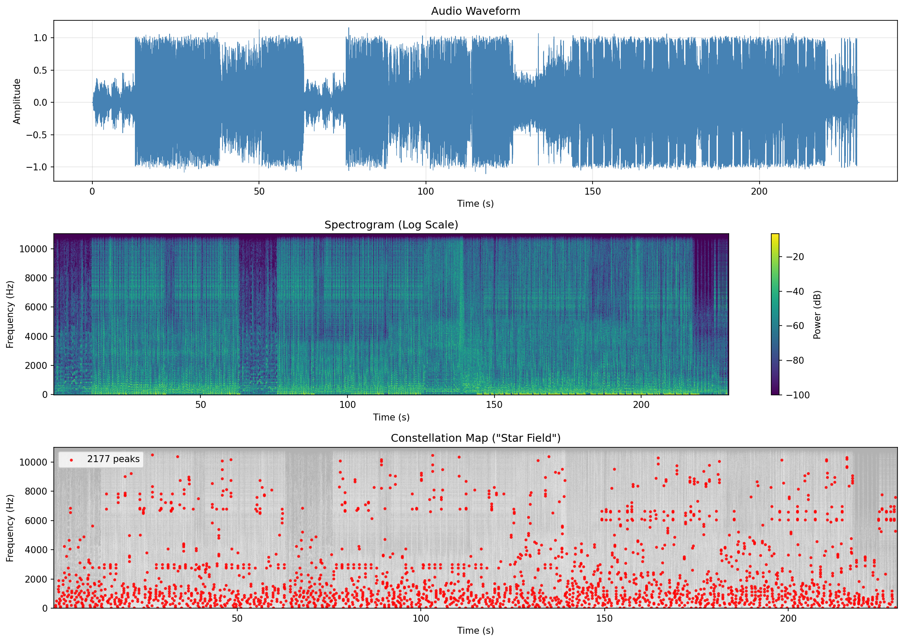

# Shazam Replica: Audio Fingerprinting & Recognition System

This project is a powerful audio recognition system built in Python, inspired by the Shazam algorithm. It uses spectral analysis and combinatorial hashing to create unique fingerprints for audio tracks, allowing for fast and accurate identification of songs even from short, noisy samples.

## 🌟 Key Features

*   **Fast Audio Identification**: Identify songs from short clips (as little as 3-5 seconds).
*   **Robust Fingerprinting**: Uses combinatorial hashing that is resilient to noise and distortion.
*   **Visualizations**: Includes tools to visualize spectrograms, constellation maps, and hash generation.
*   **Web Interface**: Clean, futuristic Flask-based UI for uploading and identifying songs.
*   **Database Management**: Efficient in-memory database with persistent storage (using Pickle/JSON).
*   **Automatic Cleanup**: Background utility to manage storage by deleting old upload files.

## 🚀 How It Works

The system follows a three-phase pipeline to fingerprint and identify audio:

### 1. Spectrogram Generation
The raw audio signal is converted into a time-frequency representation using the Short-Time Fourier Transform (STFT). We uses a Hanning window (size 4096) to generate a high-resolution spectrogram.

### 2. Constellation Map (Peak Detection)
We process the spectrogram to find "peaks" — points of high energy that are robust to noise (local maxima).
*   **Density Control**: To ensure uniform coverage of the audio features, we limit the number of peaks per time window (default: 5 peaks per 0.5s window).
*   This results in a "Constellation Map" of the audio (Time vs. Frequency points).


*Figure 1: A constellation map showing the highest energy peaks in the spectrogram.*

### 3. Combinatorial Hash Generation
To make the fingerprints unique and time-invariant, we don't just use single points. We use **pairs of points**.
*   **Anchors & Targets**: For each peak (anchor), we look at a "Target Zone" ahead in time (0s to 2s).
*   **Hashing**: We form a hash from the frequency of the anchor, the frequency of the target, and the time difference between them:
    `Hash = (Anchor_Freq + Target_Freq + Delta_Time)`
*   This creates a robust "fingerprint" that describes the relationship between points in the spectrogram.


*Figure 2: Visualizing the hash generation process. Lines connect "anchor" points to "target" points within the target zone to create unique hashes.*

### 4. Matching & Scoring
When identifying a song:
1.  **Inverse Index**: We look up all hashes from the query in our database.
2.  **Time Offset Calculation**: If a query matches a database track, the hashes will have a constant time offset relative to each other (the diagonal line in a scatter plot).
3.  **Histogram Analysis**: We find the most common time offset (the peak in the histogram) to determine the match score and confidence.

## 📂 Project Structure

*   `main.py`: The entry point for the Flask web application.
*   `utils/`: Core algorithmic logic.
    *   `fingerprint.py`: Handles the generation of combinatorial hashes.
    *   `audio_utils.py`: Signal processing, STFT, and peak finding.
    *   `database.py`: Manages the in-memory hash database and song metadata.
    *   `matcher.py`: Logic for scoring and identifying songs.
    *   `config.py`: Configuration for sample rates, FFT sizes, and hash parameters.
*   `data/`: Storage directory.
    *   `uploads/`: Temporary storage for uploaded query files.
    *   `db/`: Database files (`fingerprint_database.pkl` and `song_metadata.json`).
    *   `db_tracks/`: Folder to place original song files for indexing.
*   `images/`: Contains visualization assets.

## 🛠️ Usage

### 1. Installation
Ensure you have Python installed. Install dependencies (assuming a `pyproject.toml` or `requirements.txt` exists):

```bash
pip install -r requirements.txt
# or if using uv/poetry
uv sync
```

### 2. Running the Server
Start the Flask application:

```bash
python main.py
```

The server will start at `http://localhost:5000`.

### 3. Adding Songs
To recognize songs, you first need to add them to the database.
1.  Place your `.mp3` or `.wav` files in the `data/db_tracks/` folder.
2.  Use the `utils/database.py` script to index them, or use the API:
    ```bash
    python -m utils.database
    ```

### 4. Identifying Songs
*   Open the web interface at `http://localhost:5000`.
*   Upload an audio clip or use the recording feature.
*   The system will compare the clip against the database and return the best match with a confidence score.
